# Modelagem de Classes — Meu Gestor MedSystem

> Baseado em `Modelagem_Banco_Dados_DER_Meu_Gestor_MedSystem.docx`  
> Banco: PostgreSQL 16+ · Arquitetura: SaaS multi-tenant · Identificadores: UUID


_Visão geral dos módulos. Os diagramas Mermaid das seções seguintes apresentam as classes e relações com maior detalhe._

### Diagrama UML clínico


_Versão em formato UML tradicional, com atributos, métodos, associações e cardinalidades._

### Fontes UML editáveis

A modelagem completa e modular em PlantUML está disponível em [`uml/README.md`](./uml/README.md). Os diagramas foram separados por domínio para facilitar alterações, revisão e geração de novas imagens.

### Diagramas UML renderizados

As imagens abaixo são geradas a partir dos arquivos PlantUML e usam o formato visual solicitado: classes amarelas, atributos e métodos separados, ícones, associações e cardinalidades.

Para navegar somente pelas imagens, consulte o [`índice visual da pasta rendered`](./uml/rendered/Modelagem_Classes_Meu_Gestor_MedSystem.md).

<details>
<summary><strong>Visão geral</strong></summary>

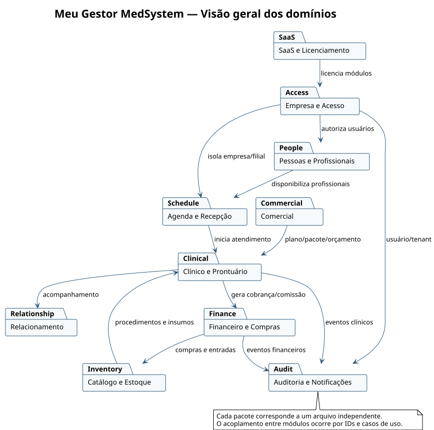

</details>

<details>
<summary><strong>SaaS, empresa e acesso</strong></summary>

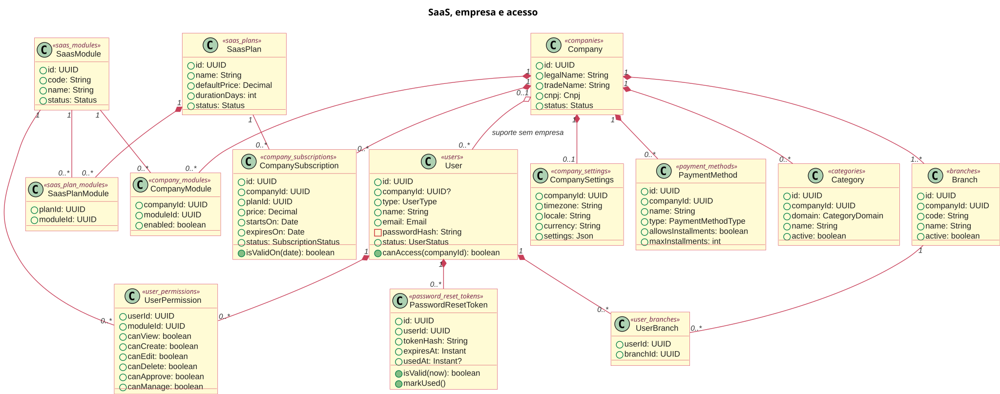

</details>

<details>
<summary><strong>Pessoas, profissionais e agenda</strong></summary>

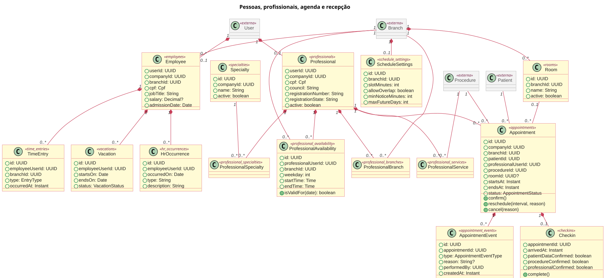

</details>

<details>
<summary><strong>Paciente e domínio clínico</strong></summary>

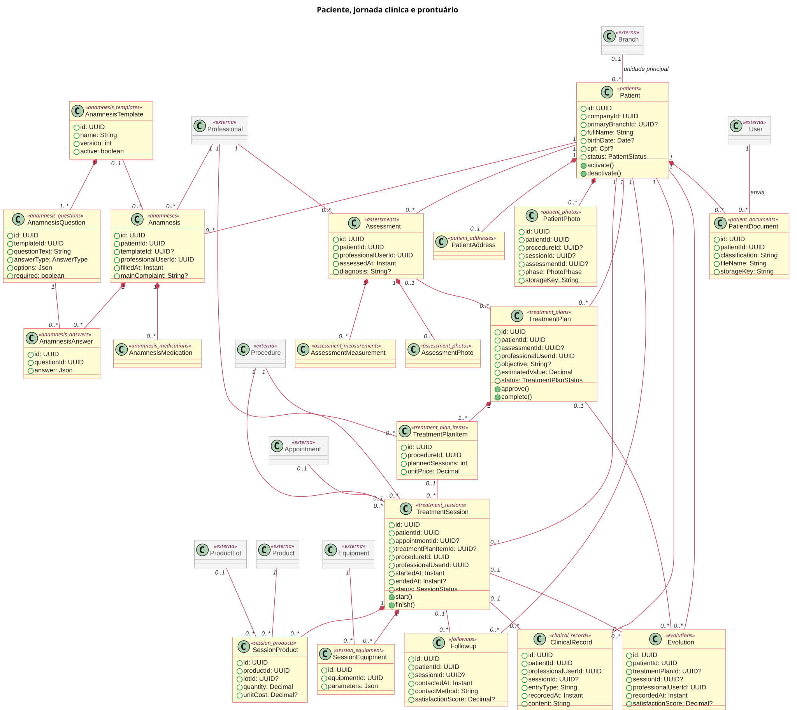

</details>

<details>
<summary><strong>Catálogo e estoque</strong></summary>

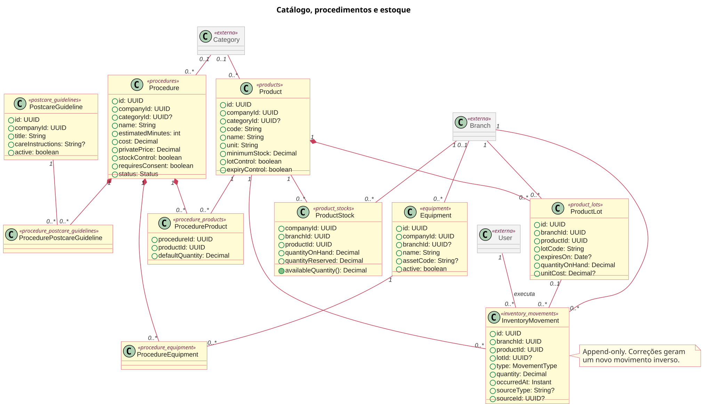

</details>

<details open>
<summary><strong>Comercial, pacotes, promoções e consentimentos</strong></summary>

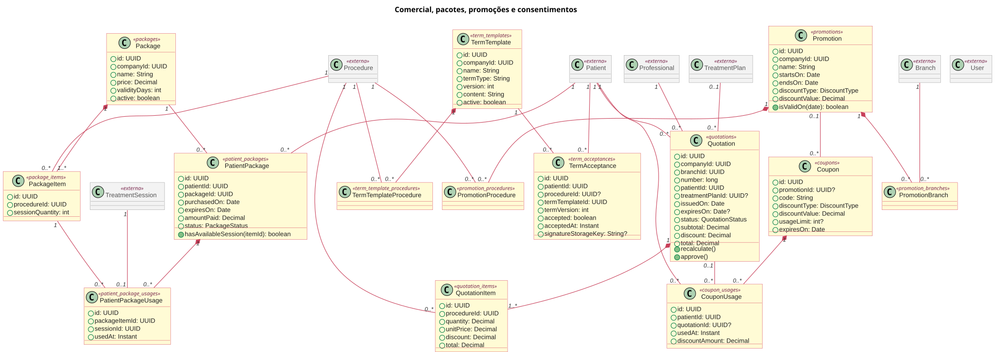

</details>

<details>
<summary><strong>Financeiro, compras e comissões</strong></summary>

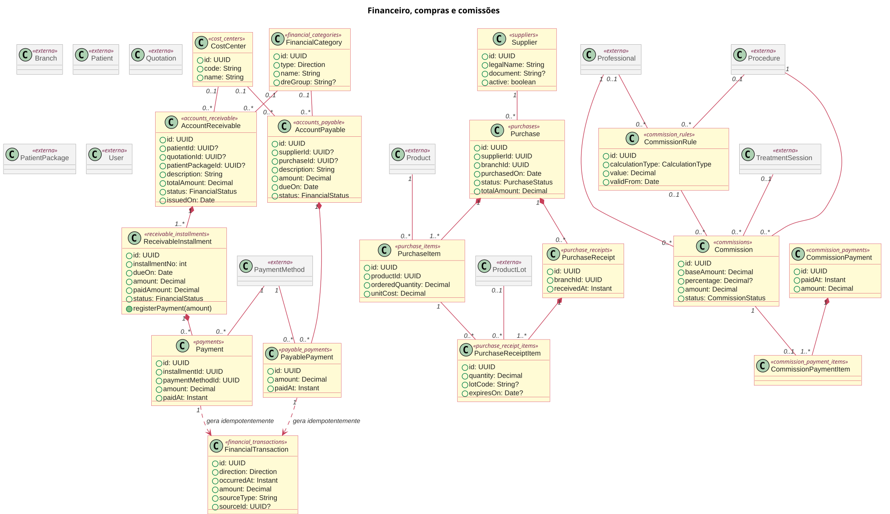

</details>

<details>
<summary><strong>Relacionamento e auditoria</strong></summary>

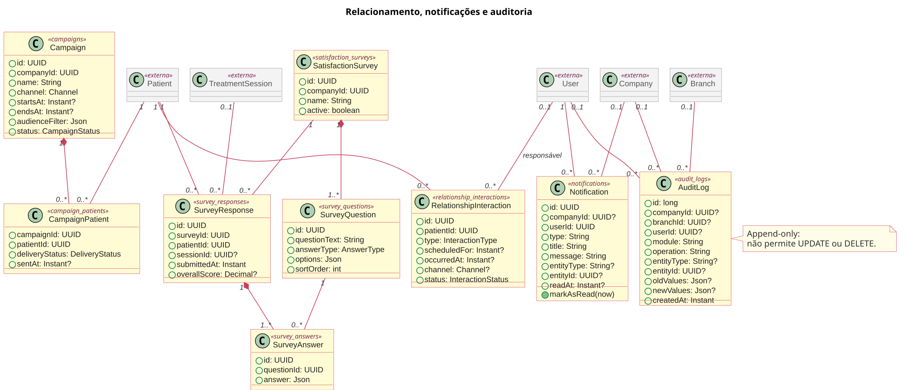

</details>

## Navegação dos diagramas UML

| Domínio | Diagrama | Responsabilidade principal |
|---|---|---|
| Base | [Classes-base](#classes-base) | Identidade, auditoria e multi-tenancy |
| SaaS e acesso | [SaaS, empresa e acesso](#4-saas-empresa-e-acesso) | Licença, empresas, filiais, usuários e permissões |
| Pessoas | [Pessoas e profissionais](#5-pessoas-e-profissionais) | Funcionários, profissionais e disponibilidade |
| Agenda | [Agenda e recepção](#6-agenda-e-recepção) | Agendamentos, eventos, salas e check-in |
| Clínico | [Paciente e jornada clínica](#7-paciente-e-jornada-clínica) | Cadastro, anamnese e avaliação |
| Tratamento | [Tratamento e prontuário](#8-tratamento-prontuário-e-consentimentos) | Planos, sessões, evoluções e consentimentos |
| Estoque | [Catálogo e estoque](#9-catálogo-e-estoque) | Procedimentos, produtos, lotes e movimentos |
| Comercial | [Comercial](#10-comercial) | Orçamentos, pacotes, promoções e cupons |
| Financeiro | [Financeiro, compras e comissões](#11-financeiro-compras-e-comissões) | Contas, pagamentos, compras e comissionamento |
| Relacionamento | [Relacionamento e auditoria](#12-relacionamento-notificações-e-auditoria) | Campanhas, pesquisas, notificações e logs |

## Como manter esta modelagem

Este Markdown é a visão documental principal. Os arquivos da pasta [`uml`](./uml/) são a versão modular para edição e exportação de imagens.

### Fluxo de alteração

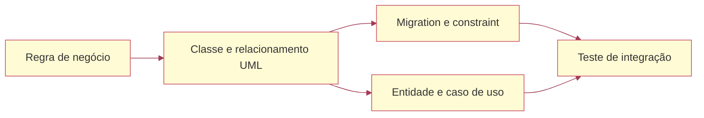
```mermaid
%%{init: {"theme":"base","themeVariables":{"primaryColor":"#fffbd5","primaryBorderColor":"#c94a61","lineColor":"#a33c54","textColor":"#252525","fontFamily":"Arial"}}}%%
flowchart LR
    RN[Regra de negócio] --> UML[Classe e relacionamento UML]
    UML --> DB[Migration e constraint]
    UML --> CODE[Entidade e caso de uso]
    DB --> TEST[Teste de integração]
    CODE --> TEST
```

Ao modificar o sistema:

1. Localize o domínio pela tabela de navegação.
2. Altere somente as classes e relações afetadas.
3. Atualize o arquivo PlantUML correspondente em `uml/`.
4. Atualize migration, enum e constraint quando houver impacto no banco.
5. Atualize os testes das regras alteradas.
6. Não replique uma classe completa em vários módulos; fora do domínio proprietário, use apenas referência por ID.

### Fonte oficial por informação

| Informação | Fonte oficial |
|---|---|
| Regra e comportamento | Classe e serviço de domínio |
| Estrutura física, tipo e constraint | Migration PostgreSQL |
| Visão e relacionamento entre classes | Este Markdown e arquivos `.puml` |
| Formato de entrada e saída da API | DTO/OpenAPI |
| Indicadores e dashboards | Views e modelos de leitura |

### Padrão para novas classes

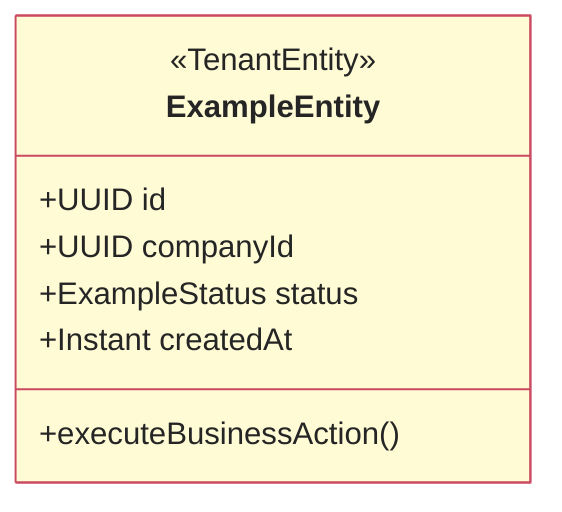
```mermaid
%%{init: {"theme":"base","themeVariables":{"primaryColor":"#fffbd5","primaryBorderColor":"#c94a61","lineColor":"#a33c54","textColor":"#252525","fontFamily":"Arial"}}}%%
classDiagram
class ExampleEntity {
  <<TenantEntity>>
  +UUID id
  +UUID companyId
  +ExampleStatus status
  +Instant createdAt
  +executeBusinessAction()
}
```

Inclua no diagrama apenas atributos que identificam a entidade, participam de regras ou explicam relacionamentos. Campos secundários continuam no dicionário de dados, evitando diagramas grandes e difíceis de ler.

## 1. Objetivo

Este documento transforma o DER em uma modelagem de classes orientada a domínio. A divisão em módulos reduz acoplamento, facilita testes e permite alterar uma área sem afetar desnecessariamente as demais.

Os diagramas representam as classes persistentes e seus principais relacionamentos. Campos puramente técnicos podem ser herdados das classes-base, evitando repetição no código.

## 2. Convenções

- Classes usam nomes no singular e em `PascalCase`.
- Atributos usam `camelCase`.
- IDs são `UUID`, exceto `AuditLog.id`, que é sequencial.
- Valores monetários usam `Decimal`; nunca `float`.
- Data e hora usam tipos com fuso (`Instant`, `OffsetDateTime` ou equivalente).
- Todo dado operacional implementa `TenantEntity` e possui `companyId`.
- Chaves estrangeiras são representadas por IDs na persistência. Objetos relacionados devem ser carregados somente quando necessários.
- Estados e tipos fechados devem ser `enum`, não textos livres.
- Arquivos ficam em object storage; a classe mantém apenas `storageKey` e metadados.
- Relações N:N com dados próprios são classes associativas explícitas.
- Relatórios e dashboards são modelos de leitura, não entidades transacionais.

### Classes-base

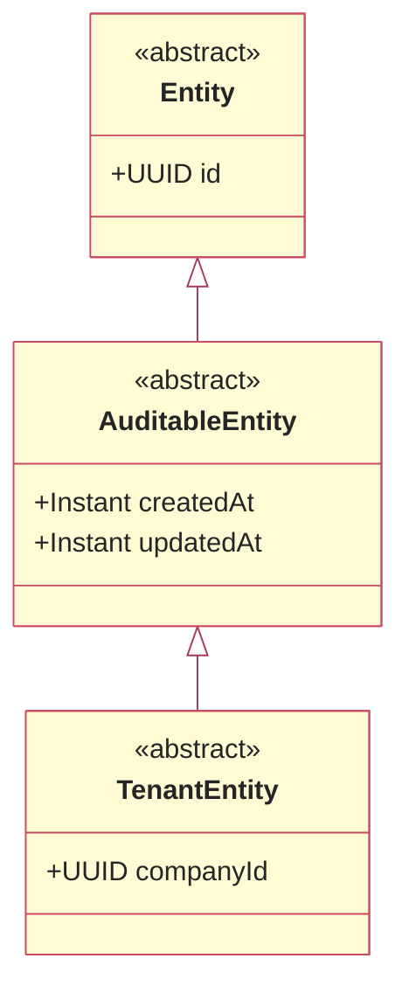
```mermaid
%%{init: {"theme":"base","themeVariables":{"primaryColor":"#fffbd5","primaryBorderColor":"#c94a61","lineColor":"#a33c54","textColor":"#252525","fontFamily":"Arial"}}}%%
classDiagram
class Entity {
  <<abstract>>
  +UUID id
}
class AuditableEntity {
  <<abstract>>
  +Instant createdAt
  +Instant updatedAt
}
class TenantEntity {
  <<abstract>>
  +UUID companyId
}
Entity <|-- AuditableEntity
AuditableEntity <|-- TenantEntity
```

Nem todas as tabelas precisam herdar fisicamente dessas classes. Elas definem um contrato comum para a aplicação.

## 3. Organização sugerida do código

```text
src/
├── shared/                 # UUID, dinheiro, datas, paginação e erros
├── tenancy/                # empresa, filial e isolamento de tenant
├── access/                 # usuários, permissões e autenticação
├── scheduling/             # agenda, disponibilidade e check-in
├── clinical/               # paciente, anamnese, avaliação e prontuário
├── catalog/                # procedimentos, equipamentos e orientações
├── inventory/              # produtos, lotes e movimentações
├── commercial/             # planos, orçamentos, pacotes e promoções
├── financial/              # contas, pagamentos, caixa e comissões
├── purchasing/             # fornecedores e compras
├── people/                 # profissionais, equipe e RH
├── relationship/           # campanhas, pesquisas e acompanhamentos
└── audit/                  # notificações e auditoria
```

Cada módulo deve expor casos de uso ou serviços de aplicação, e não seus repositórios internos.

## 4. SaaS, empresa e acesso

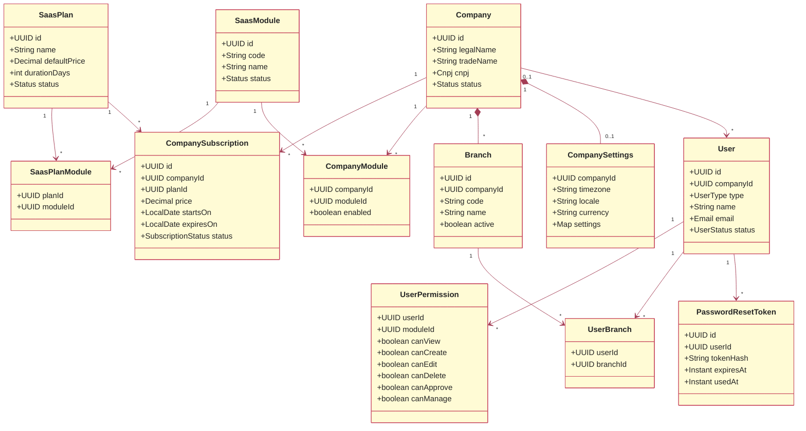
```mermaid
%%{init: {"theme":"base","themeVariables":{"primaryColor":"#fffbd5","primaryBorderColor":"#c94a61","lineColor":"#a33c54","textColor":"#252525","fontFamily":"Arial"}}}%%
classDiagram
class SaasPlan {
  +UUID id
  +String name
  +Decimal defaultPrice
  +int durationDays
  +Status status
}
class SaasModule {
  +UUID id
  +String code
  +String name
  +Status status
}
class SaasPlanModule {
  +UUID planId
  +UUID moduleId
}
class Company {
  +UUID id
  +String legalName
  +String tradeName
  +Cnpj cnpj
  +Status status
}
class CompanySubscription {
  +UUID id
  +UUID companyId
  +UUID planId
  +Decimal price
  +LocalDate startsOn
  +LocalDate expiresOn
  +SubscriptionStatus status
}
class CompanyModule {
  +UUID companyId
  +UUID moduleId
  +boolean enabled
}
class Branch {
  +UUID id
  +UUID companyId
  +String code
  +String name
  +boolean active
}
class CompanySettings {
  +UUID companyId
  +String timezone
  +String locale
  +String currency
  +Map settings
}
class User {
  +UUID id
  +UUID companyId
  +UserType type
  +String name
  +Email email
  +UserStatus status
}
class UserPermission {
  +UUID userId
  +UUID moduleId
  +boolean canView
  +boolean canCreate
  +boolean canEdit
  +boolean canDelete
  +boolean canApprove
  +boolean canManage
}
class UserBranch {
  +UUID userId
  +UUID branchId
}
class PasswordResetToken {
  +UUID id
  +UUID userId
  +String tokenHash
  +Instant expiresAt
  +Instant usedAt
}

SaasPlan "1" --> "*" SaasPlanModule
SaasModule "1" --> "*" SaasPlanModule
Company "1" --> "*" CompanySubscription
SaasPlan "1" --> "*" CompanySubscription
Company "1" --> "*" CompanyModule
SaasModule "1" --> "*" CompanyModule
Company "1" *-- "*" Branch
Company "1" *-- "0..1" CompanySettings
Company "0..1" --> "*" User
User "1" --> "*" UserPermission
User "1" --> "*" UserBranch
Branch "1" --> "*" UserBranch
User "1" --> "*" PasswordResetToken
```

### Regras principais

- Usuário comum deve possuir `companyId`; usuário de suporte pode ter `companyId` nulo.
- Uma assinatura não pode terminar antes de começar.
- O acesso efetivo exige módulo habilitado para a empresa e permissão concedida ao usuário.
- O e-mail deve ser único por empresa, ignorando maiúsculas/minúsculas.
- O hash de senha não deve ser exposto pelo domínio nem por DTOs de resposta.

## 5. Pessoas e profissionais

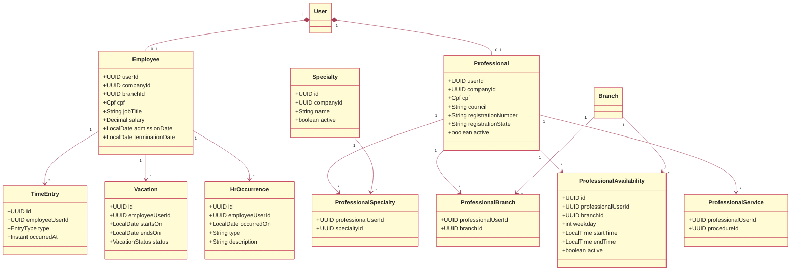
```mermaid
%%{init: {"theme":"base","themeVariables":{"primaryColor":"#fffbd5","primaryBorderColor":"#c94a61","lineColor":"#a33c54","textColor":"#252525","fontFamily":"Arial"}}}%%
classDiagram
class User
class Branch
class Employee {
  +UUID userId
  +UUID companyId
  +UUID branchId
  +Cpf cpf
  +String jobTitle
  +Decimal salary
  +LocalDate admissionDate
  +LocalDate terminationDate
}
class TimeEntry {
  +UUID id
  +UUID employeeUserId
  +EntryType type
  +Instant occurredAt
}
class Vacation {
  +UUID id
  +UUID employeeUserId
  +LocalDate startsOn
  +LocalDate endsOn
  +VacationStatus status
}
class HrOccurrence {
  +UUID id
  +UUID employeeUserId
  +LocalDate occurredOn
  +String type
  +String description
}
class Professional {
  +UUID userId
  +UUID companyId
  +Cpf cpf
  +String council
  +String registrationNumber
  +String registrationState
  +boolean active
}
class Specialty {
  +UUID id
  +UUID companyId
  +String name
  +boolean active
}
class ProfessionalSpecialty {
  +UUID professionalUserId
  +UUID specialtyId
}
class ProfessionalBranch {
  +UUID professionalUserId
  +UUID branchId
}
class ProfessionalAvailability {
  +UUID id
  +UUID professionalUserId
  +UUID branchId
  +int weekday
  +LocalTime startTime
  +LocalTime endTime
  +boolean active
}
class ProfessionalService {
  +UUID professionalUserId
  +UUID procedureId
}

User "1" *-- "0..1" Employee
User "1" *-- "0..1" Professional
Employee "1" --> "*" TimeEntry
Employee "1" --> "*" Vacation
Employee "1" --> "*" HrOccurrence
Professional "1" --> "*" ProfessionalSpecialty
Specialty "1" --> "*" ProfessionalSpecialty
Professional "1" --> "*" ProfessionalBranch
Branch "1" --> "*" ProfessionalBranch
Professional "1" --> "*" ProfessionalAvailability
Branch "1" --> "*" ProfessionalAvailability
Professional "1" --> "*" ProfessionalService
```

`Employee` e `Professional` são extensões opcionais de `User`, com relação 1:1. Um mesmo usuário pode exercer ambos os papéis quando a regra de negócio permitir.

## 6. Agenda e recepção

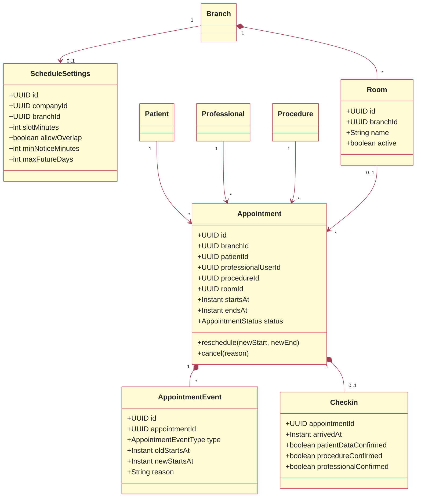
```mermaid
%%{init: {"theme":"base","themeVariables":{"primaryColor":"#fffbd5","primaryBorderColor":"#c94a61","lineColor":"#a33c54","textColor":"#252525","fontFamily":"Arial"}}}%%
classDiagram
class ScheduleSettings {
  +UUID id
  +UUID companyId
  +UUID branchId
  +int slotMinutes
  +boolean allowOverlap
  +int minNoticeMinutes
  +int maxFutureDays
}
class Room {
  +UUID id
  +UUID branchId
  +String name
  +boolean active
}
class Appointment {
  +UUID id
  +UUID branchId
  +UUID patientId
  +UUID professionalUserId
  +UUID procedureId
  +UUID roomId
  +Instant startsAt
  +Instant endsAt
  +AppointmentStatus status
  +reschedule(newStart, newEnd)
  +cancel(reason)
}
class AppointmentEvent {
  +UUID id
  +UUID appointmentId
  +AppointmentEventType type
  +Instant oldStartsAt
  +Instant newStartsAt
  +String reason
}
class Checkin {
  +UUID appointmentId
  +Instant arrivedAt
  +boolean patientDataConfirmed
  +boolean procedureConfirmed
  +boolean professionalConfirmed
}
class Patient
class Professional
class Procedure
class Branch

Branch "1" --> "0..1" ScheduleSettings
Branch "1" *-- "*" Room
Patient "1" --> "*" Appointment
Professional "1" --> "*" Appointment
Procedure "1" --> "*" Appointment
Room "0..1" --> "*" Appointment
Appointment "1" *-- "*" AppointmentEvent
Appointment "1" *-- "0..1" Checkin
```

### Regras principais

- `endsAt` deve ser posterior a `startsAt`.
- Antes da confirmação, validar disponibilidade do profissional e da sala.
- Reagendamento, cancelamento e mudança de status sempre geram `AppointmentEvent`.
- Existe no máximo um `Checkin` por agendamento.
- Validações de concorrência devem ocorrer também no banco/transação, não apenas na interface.

## 7. Paciente e jornada clínica

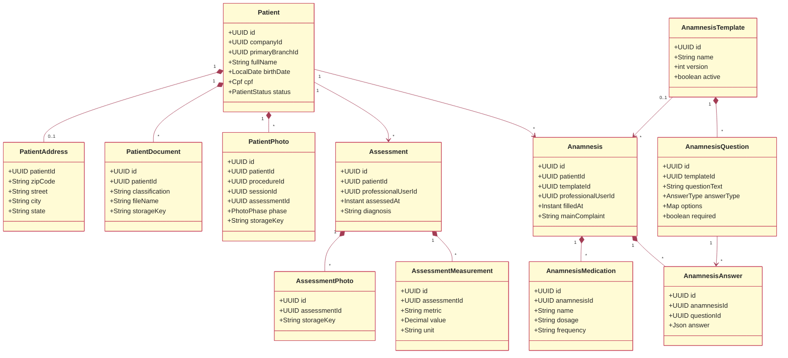
```mermaid
%%{init: {"theme":"base","themeVariables":{"primaryColor":"#fffbd5","primaryBorderColor":"#c94a61","lineColor":"#a33c54","textColor":"#252525","fontFamily":"Arial"}}}%%
classDiagram
class Patient {
  +UUID id
  +UUID companyId
  +UUID primaryBranchId
  +String fullName
  +LocalDate birthDate
  +Cpf cpf
  +PatientStatus status
}
class PatientAddress {
  +UUID patientId
  +String zipCode
  +String street
  +String city
  +String state
}
class PatientDocument {
  +UUID id
  +UUID patientId
  +String classification
  +String fileName
  +String storageKey
}
class PatientPhoto {
  +UUID id
  +UUID patientId
  +UUID procedureId
  +UUID sessionId
  +UUID assessmentId
  +PhotoPhase phase
  +String storageKey
}
class AnamnesisTemplate {
  +UUID id
  +String name
  +int version
  +boolean active
}
class AnamnesisQuestion {
  +UUID id
  +UUID templateId
  +String questionText
  +AnswerType answerType
  +Map options
  +boolean required
}
class Anamnesis {
  +UUID id
  +UUID patientId
  +UUID templateId
  +UUID professionalUserId
  +Instant filledAt
  +String mainComplaint
}
class AnamnesisAnswer {
  +UUID id
  +UUID anamnesisId
  +UUID questionId
  +Json answer
}
class AnamnesisMedication {
  +UUID id
  +UUID anamnesisId
  +String name
  +String dosage
  +String frequency
}
class Assessment {
  +UUID id
  +UUID patientId
  +UUID professionalUserId
  +Instant assessedAt
  +String diagnosis
}
class AssessmentMeasurement {
  +UUID id
  +UUID assessmentId
  +String metric
  +Decimal value
  +String unit
}
class AssessmentPhoto {
  +UUID id
  +UUID assessmentId
  +String storageKey
}

Patient "1" *-- "0..1" PatientAddress
Patient "1" *-- "*" PatientDocument
Patient "1" *-- "*" PatientPhoto
AnamnesisTemplate "1" *-- "*" AnamnesisQuestion
Patient "1" --> "*" Anamnesis
AnamnesisTemplate "0..1" --> "*" Anamnesis
Anamnesis "1" *-- "*" AnamnesisAnswer
AnamnesisQuestion "1" --> "*" AnamnesisAnswer
Anamnesis "1" *-- "*" AnamnesisMedication
Patient "1" --> "*" Assessment
Assessment "1" *-- "*" AssessmentMeasurement
Assessment "1" *-- "*" AssessmentPhoto
```

### Regras principais

- A versão do modelo de anamnese usada no preenchimento deve permanecer rastreável.
- Respostas devem ser validadas conforme `answerType`, opções e obrigatoriedade.
- Dados clínicos exigem autorização por empresa, filial e perfil, além de trilha de auditoria.
- Exclusão clínica deve seguir política de retenção; prefira inativação/anonimização quando aplicável.

## 8. Tratamento, prontuário e consentimentos

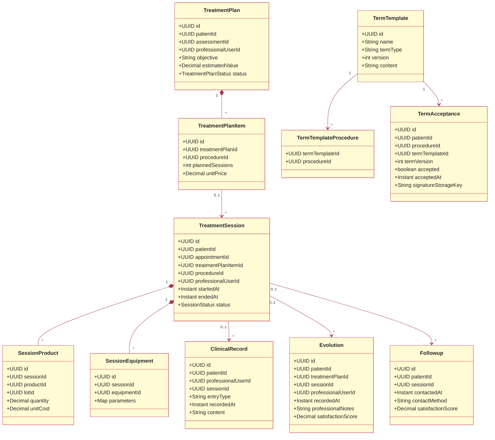
```mermaid
%%{init: {"theme":"base","themeVariables":{"primaryColor":"#fffbd5","primaryBorderColor":"#c94a61","lineColor":"#a33c54","textColor":"#252525","fontFamily":"Arial"}}}%%
classDiagram
class TreatmentPlan {
  +UUID id
  +UUID patientId
  +UUID assessmentId
  +UUID professionalUserId
  +String objective
  +Decimal estimatedValue
  +TreatmentPlanStatus status
}
class TreatmentPlanItem {
  +UUID id
  +UUID treatmentPlanId
  +UUID procedureId
  +int plannedSessions
  +Decimal unitPrice
}
class TreatmentSession {
  +UUID id
  +UUID patientId
  +UUID appointmentId
  +UUID treatmentPlanItemId
  +UUID procedureId
  +UUID professionalUserId
  +Instant startedAt
  +Instant endedAt
  +SessionStatus status
}
class SessionProduct {
  +UUID id
  +UUID sessionId
  +UUID productId
  +UUID lotId
  +Decimal quantity
  +Decimal unitCost
}
class SessionEquipment {
  +UUID id
  +UUID sessionId
  +UUID equipmentId
  +Map parameters
}
class ClinicalRecord {
  +UUID id
  +UUID patientId
  +UUID professionalUserId
  +UUID sessionId
  +String entryType
  +Instant recordedAt
  +String content
}
class Evolution {
  +UUID id
  +UUID patientId
  +UUID treatmentPlanId
  +UUID sessionId
  +UUID professionalUserId
  +Instant recordedAt
  +String professionalNotes
  +Decimal satisfactionScore
}
class TermTemplate {
  +UUID id
  +String name
  +String termType
  +int version
  +String content
}
class TermTemplateProcedure {
  +UUID termTemplateId
  +UUID procedureId
}
class TermAcceptance {
  +UUID id
  +UUID patientId
  +UUID procedureId
  +UUID termTemplateId
  +int termVersion
  +boolean accepted
  +Instant acceptedAt
  +String signatureStorageKey
}
class Followup {
  +UUID id
  +UUID patientId
  +UUID sessionId
  +Instant contactedAt
  +String contactMethod
  +Decimal satisfactionScore
}

TreatmentPlan "1" *-- "*" TreatmentPlanItem
TreatmentPlanItem "0..1" --> "*" TreatmentSession
TreatmentSession "1" *-- "*" SessionProduct
TreatmentSession "1" *-- "*" SessionEquipment
TreatmentSession "0..1" --> "*" ClinicalRecord
TreatmentSession "0..1" --> "*" Evolution
TreatmentSession "0..1" --> "*" Followup
TermTemplate "1" --> "*" TermTemplateProcedure
TermTemplate "1" --> "*" TermAcceptance
```

Consumos registrados em `SessionProduct` devem gerar movimentações de estoque na mesma transação lógica do encerramento da sessão.

## 9. Catálogo e estoque

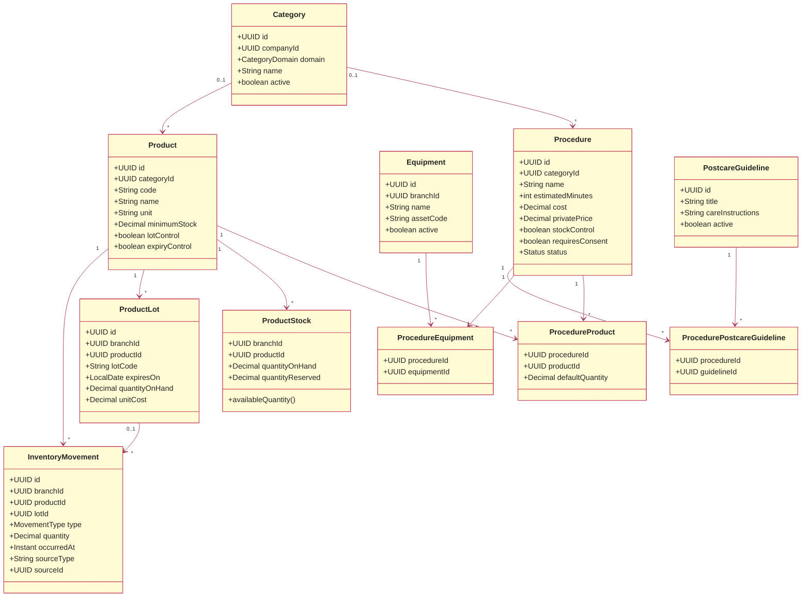
```mermaid
%%{init: {"theme":"base","themeVariables":{"primaryColor":"#fffbd5","primaryBorderColor":"#c94a61","lineColor":"#a33c54","textColor":"#252525","fontFamily":"Arial"}}}%%
classDiagram
class Category {
  +UUID id
  +UUID companyId
  +CategoryDomain domain
  +String name
  +boolean active
}
class Procedure {
  +UUID id
  +UUID categoryId
  +String name
  +int estimatedMinutes
  +Decimal cost
  +Decimal privatePrice
  +boolean stockControl
  +boolean requiresConsent
  +Status status
}
class Equipment {
  +UUID id
  +UUID branchId
  +String name
  +String assetCode
  +boolean active
}
class ProcedureProduct {
  +UUID procedureId
  +UUID productId
  +Decimal defaultQuantity
}
class ProcedureEquipment {
  +UUID procedureId
  +UUID equipmentId
}
class Product {
  +UUID id
  +UUID categoryId
  +String code
  +String name
  +String unit
  +Decimal minimumStock
  +boolean lotControl
  +boolean expiryControl
}
class ProductStock {
  +UUID branchId
  +UUID productId
  +Decimal quantityOnHand
  +Decimal quantityReserved
  +availableQuantity()
}
class ProductLot {
  +UUID id
  +UUID branchId
  +UUID productId
  +String lotCode
  +LocalDate expiresOn
  +Decimal quantityOnHand
  +Decimal unitCost
}
class InventoryMovement {
  +UUID id
  +UUID branchId
  +UUID productId
  +UUID lotId
  +MovementType type
  +Decimal quantity
  +Instant occurredAt
  +String sourceType
  +UUID sourceId
}
class PostcareGuideline {
  +UUID id
  +String title
  +String careInstructions
  +boolean active
}
class ProcedurePostcareGuideline {
  +UUID procedureId
  +UUID guidelineId
}

Category "0..1" --> "*" Procedure
Category "0..1" --> "*" Product
Procedure "1" --> "*" ProcedureProduct
Product "1" --> "*" ProcedureProduct
Procedure "1" --> "*" ProcedureEquipment
Equipment "1" --> "*" ProcedureEquipment
Product "1" --> "*" ProductStock
Product "1" --> "*" ProductLot
Product "1" --> "*" InventoryMovement
ProductLot "0..1" --> "*" InventoryMovement
Procedure "1" --> "*" ProcedurePostcareGuideline
PostcareGuideline "1" --> "*" ProcedurePostcareGuideline
```

### Regras principais

- `availableQuantity = quantityOnHand - quantityReserved`.
- Movimentação, saldo e lote são atualizados em uma única transação.
- Movimentos são históricos; correções devem gerar movimento inverso, não editar o passado.
- Produtos com controle de lote exigem `lotId` nas movimentações de consumo.

## 10. Comercial

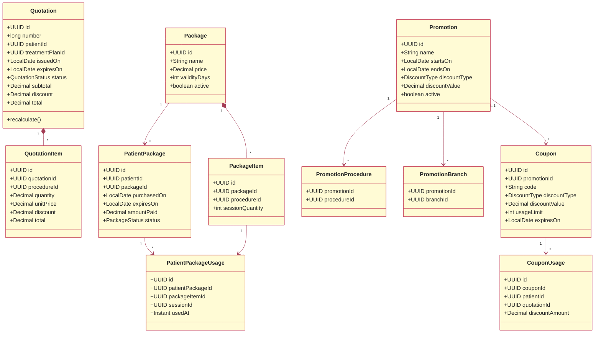
```mermaid
%%{init: {"theme":"base","themeVariables":{"primaryColor":"#fffbd5","primaryBorderColor":"#c94a61","lineColor":"#a33c54","textColor":"#252525","fontFamily":"Arial"}}}%%
classDiagram
class Quotation {
  +UUID id
  +long number
  +UUID patientId
  +UUID treatmentPlanId
  +LocalDate issuedOn
  +LocalDate expiresOn
  +QuotationStatus status
  +Decimal subtotal
  +Decimal discount
  +Decimal total
  +recalculate()
}
class QuotationItem {
  +UUID id
  +UUID quotationId
  +UUID procedureId
  +Decimal quantity
  +Decimal unitPrice
  +Decimal discount
  +Decimal total
}
class Package {
  +UUID id
  +String name
  +Decimal price
  +int validityDays
  +boolean active
}
class PackageItem {
  +UUID id
  +UUID packageId
  +UUID procedureId
  +int sessionQuantity
}
class PatientPackage {
  +UUID id
  +UUID patientId
  +UUID packageId
  +LocalDate purchasedOn
  +LocalDate expiresOn
  +Decimal amountPaid
  +PackageStatus status
}
class PatientPackageUsage {
  +UUID id
  +UUID patientPackageId
  +UUID packageItemId
  +UUID sessionId
  +Instant usedAt
}
class Promotion {
  +UUID id
  +String name
  +LocalDate startsOn
  +LocalDate endsOn
  +DiscountType discountType
  +Decimal discountValue
  +boolean active
}
class PromotionProcedure {
  +UUID promotionId
  +UUID procedureId
}
class PromotionBranch {
  +UUID promotionId
  +UUID branchId
}
class Coupon {
  +UUID id
  +UUID promotionId
  +String code
  +DiscountType discountType
  +Decimal discountValue
  +int usageLimit
  +LocalDate expiresOn
}
class CouponUsage {
  +UUID id
  +UUID couponId
  +UUID patientId
  +UUID quotationId
  +Decimal discountAmount
}

Quotation "1" *-- "*" QuotationItem
Package "1" *-- "*" PackageItem
Package "1" --> "*" PatientPackage
PatientPackage "1" --> "*" PatientPackageUsage
PackageItem "1" --> "*" PatientPackageUsage
Promotion "1" --> "*" PromotionProcedure
Promotion "1" --> "*" PromotionBranch
Promotion "0..1" --> "*" Coupon
Coupon "1" --> "*" CouponUsage
```

Totais do orçamento são calculados no domínio e validados novamente na persistência. O uso de pacote deve impedir consumo superior à quantidade contratada.

## 11. Financeiro, compras e comissões

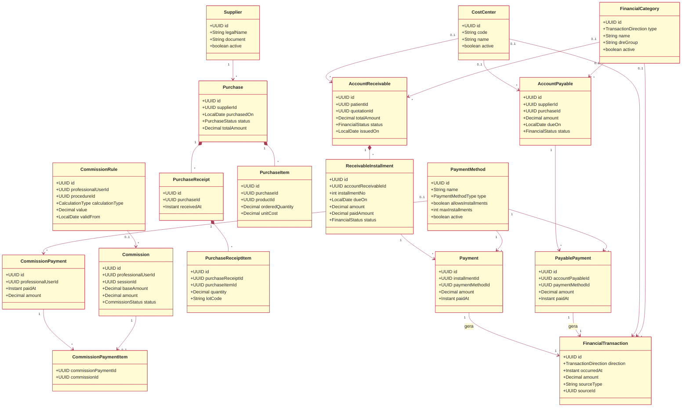
```mermaid
%%{init: {"theme":"base","themeVariables":{"primaryColor":"#fffbd5","primaryBorderColor":"#c94a61","lineColor":"#a33c54","textColor":"#252525","fontFamily":"Arial"}}}%%
classDiagram
class PaymentMethod {
  +UUID id
  +String name
  +PaymentMethodType type
  +boolean allowsInstallments
  +int maxInstallments
  +boolean active
}
class CostCenter {
  +UUID id
  +String code
  +String name
  +boolean active
}
class FinancialCategory {
  +UUID id
  +TransactionDirection type
  +String name
  +String dreGroup
  +boolean active
}
class AccountReceivable {
  +UUID id
  +UUID patientId
  +UUID quotationId
  +Decimal totalAmount
  +FinancialStatus status
  +LocalDate issuedOn
}
class ReceivableInstallment {
  +UUID id
  +UUID accountReceivableId
  +int installmentNo
  +LocalDate dueOn
  +Decimal amount
  +Decimal paidAmount
  +FinancialStatus status
}
class Payment {
  +UUID id
  +UUID installmentId
  +UUID paymentMethodId
  +Decimal amount
  +Instant paidAt
}
class AccountPayable {
  +UUID id
  +UUID supplierId
  +UUID purchaseId
  +Decimal amount
  +LocalDate dueOn
  +FinancialStatus status
}
class PayablePayment {
  +UUID id
  +UUID accountPayableId
  +UUID paymentMethodId
  +Decimal amount
  +Instant paidAt
}
class FinancialTransaction {
  +UUID id
  +TransactionDirection direction
  +Instant occurredAt
  +Decimal amount
  +String sourceType
  +UUID sourceId
}
class Supplier {
  +UUID id
  +String legalName
  +String document
  +boolean active
}
class Purchase {
  +UUID id
  +UUID supplierId
  +LocalDate purchasedOn
  +PurchaseStatus status
  +Decimal totalAmount
}
class PurchaseItem {
  +UUID id
  +UUID purchaseId
  +UUID productId
  +Decimal orderedQuantity
  +Decimal unitCost
}
class PurchaseReceipt {
  +UUID id
  +UUID purchaseId
  +Instant receivedAt
}
class PurchaseReceiptItem {
  +UUID id
  +UUID purchaseReceiptId
  +UUID purchaseItemId
  +Decimal quantity
  +String lotCode
}
class CommissionRule {
  +UUID id
  +UUID professionalUserId
  +UUID procedureId
  +CalculationType calculationType
  +Decimal value
  +LocalDate validFrom
}
class Commission {
  +UUID id
  +UUID professionalUserId
  +UUID sessionId
  +Decimal baseAmount
  +Decimal amount
  +CommissionStatus status
}
class CommissionPayment {
  +UUID id
  +UUID professionalUserId
  +Instant paidAt
  +Decimal amount
}
class CommissionPaymentItem {
  +UUID commissionPaymentId
  +UUID commissionId
}

AccountReceivable "1" *-- "*" ReceivableInstallment
ReceivableInstallment "1" --> "*" Payment
PaymentMethod "1" --> "*" Payment
Payment "1" --> "1" FinancialTransaction : gera
AccountPayable "1" --> "*" PayablePayment
PaymentMethod "1" --> "*" PayablePayment
PayablePayment "1" --> "1" FinancialTransaction : gera
CostCenter "0..1" --> "*" AccountReceivable
CostCenter "0..1" --> "*" AccountPayable
CostCenter "0..1" --> "*" FinancialTransaction
FinancialCategory "0..1" --> "*" AccountReceivable
FinancialCategory "0..1" --> "*" AccountPayable
FinancialCategory "0..1" --> "*" FinancialTransaction
Supplier "1" --> "*" Purchase
Purchase "1" *-- "*" PurchaseItem
Purchase "1" *-- "*" PurchaseReceipt
PurchaseReceipt "1" *-- "*" PurchaseReceiptItem
CommissionRule "0..1" --> "*" Commission
CommissionPayment "1" --> "*" CommissionPaymentItem
Commission "1" --> "0..1" CommissionPaymentItem
PaymentMethod "0..1" --> "*" CommissionPayment
```

### Regras principais

- Pagamentos geram `FinancialTransaction` de forma idempotente.
- A soma das parcelas deve ser igual ao total da conta, respeitando arredondamento monetário.
- Recebimento de compra gera lotes e movimentos de entrada de estoque atomicamente.
- Uma comissão não pode pertencer a mais de um pagamento.
- DRE e fluxo de caixa são projeções de leitura, nunca fontes primárias de escrita.

## 12. Relacionamento, notificações e auditoria

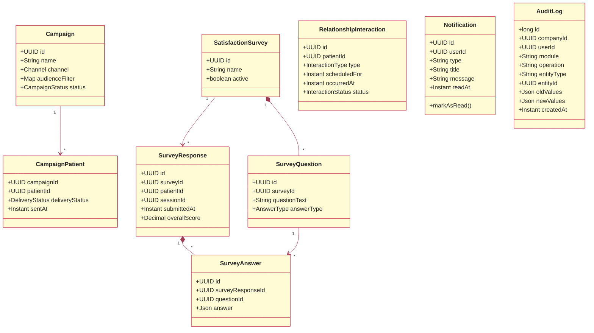
```mermaid
%%{init: {"theme":"base","themeVariables":{"primaryColor":"#fffbd5","primaryBorderColor":"#c94a61","lineColor":"#a33c54","textColor":"#252525","fontFamily":"Arial"}}}%%
classDiagram
class Campaign {
  +UUID id
  +String name
  +Channel channel
  +Map audienceFilter
  +CampaignStatus status
}
class CampaignPatient {
  +UUID campaignId
  +UUID patientId
  +DeliveryStatus deliveryStatus
  +Instant sentAt
}
class SatisfactionSurvey {
  +UUID id
  +String name
  +boolean active
}
class SurveyQuestion {
  +UUID id
  +UUID surveyId
  +String questionText
  +AnswerType answerType
}
class SurveyResponse {
  +UUID id
  +UUID surveyId
  +UUID patientId
  +UUID sessionId
  +Instant submittedAt
  +Decimal overallScore
}
class SurveyAnswer {
  +UUID id
  +UUID surveyResponseId
  +UUID questionId
  +Json answer
}
class RelationshipInteraction {
  +UUID id
  +UUID patientId
  +InteractionType type
  +Instant scheduledFor
  +Instant occurredAt
  +InteractionStatus status
}
class Notification {
  +UUID id
  +UUID userId
  +String type
  +String title
  +String message
  +Instant readAt
  +markAsRead()
}
class AuditLog {
  +long id
  +UUID companyId
  +UUID userId
  +String module
  +String operation
  +String entityType
  +UUID entityId
  +Json oldValues
  +Json newValues
  +Instant createdAt
}

Campaign "1" --> "*" CampaignPatient
SatisfactionSurvey "1" *-- "*" SurveyQuestion
SatisfactionSurvey "1" --> "*" SurveyResponse
SurveyResponse "1" *-- "*" SurveyAnswer
SurveyQuestion "1" --> "*" SurveyAnswer
```

`AuditLog` é append-only: não oferece métodos de alteração ou exclusão. `Notification` pertence ao usuário e pode ser marcada como lida, sem apagar o histórico necessário.

## 13. Serviços de domínio e casos de uso

Classes de entidade preservam invariantes locais. Fluxos que atravessam vários agregados ficam em serviços de aplicação:

| Serviço/caso de uso | Responsabilidade |
|---|---|
| `AccessPolicyService` | Combinar licença, módulo, filial e permissão do usuário |
| `ScheduleAppointmentUseCase` | Validar disponibilidade e criar agendamento/evento |
| `CheckinPatientUseCase` | Confirmar dados e registrar chegada |
| `CloseTreatmentSessionUseCase` | Encerrar sessão, consumir estoque e gerar comissão |
| `ReceivePurchaseUseCase` | Registrar recebimento, lote e entrada de estoque |
| `RegisterReceivablePaymentUseCase` | Baixar parcela e gerar transação financeira idempotente |
| `RegisterPayablePaymentUseCase` | Baixar conta e gerar saída financeira idempotente |
| `UsePatientPackageUseCase` | Validar saldo/validade e vincular uso à sessão |
| `AcceptTermUseCase` | Congelar versão aceita e registrar evidências da assinatura |
| `AuditService` | Acrescentar evento imutável de auditoria |

## 14. Agregados e limites transacionais

| Raiz do agregado | Componentes internos | Referências externas por ID |
|---|---|---|
| `Appointment` | `AppointmentEvent`, `Checkin` | paciente, profissional, procedimento, sala |
| `Anamnesis` | respostas, medicamentos | paciente, modelo, profissional |
| `Assessment` | medidas, fotos | paciente, profissional |
| `TreatmentPlan` | itens | paciente, avaliação, procedimentos |
| `TreatmentSession` | produtos, equipamentos | plano, procedimento, paciente, profissional |
| `Quotation` | itens | paciente, profissional, plano |
| `Package` | itens | procedimentos |
| `PatientPackage` | usos | paciente, pacote, sessões |
| `AccountReceivable` | parcelas | paciente, orçamento, categorias |
| `Purchase` | itens, recebimentos | fornecedor, produtos, filial |
| `SatisfactionSurvey` | perguntas | empresa |
| `SurveyResponse` | respostas | pesquisa, paciente, sessão |

Evite carregar grafos completos. Por exemplo, `Patient` não deve manter em memória todas as consultas, fotos, anamneses e transações; consulte esses históricos por repositórios específicos e paginação.

## 15. Interfaces de repositório

```text
PatientRepository
  findById(companyId, patientId)
  search(companyId, filters, page)
  save(patient)

AppointmentRepository
  findById(companyId, appointmentId)
  findConflicts(companyId, branchId, professionalId, roomId, interval)
  save(appointment)

InventoryRepository
  lockStock(companyId, branchId, productId)
  appendMovement(movement)
  updateBalance(stock)

FinancialTransactionRepository
  existsBySource(companyId, sourceType, sourceId)
  append(transaction)
```

Todo método operacional recebe `companyId`, inclusive quando o ID da entidade já é conhecido. Isso reduz o risco de acesso cruzado entre tenants.

## 16. Objetos de valor recomendados

Use objetos de valor pequenos e imutáveis para concentrar validações recorrentes:

- `Cpf` e `Cnpj`: normalização e dígitos verificadores.
- `Email`: normalização e validação básica.
- `Money`: valor decimal e moeda, com arredondamento explícito.
- `DateRange` e `TimeInterval`: início/fim e detecção de sobreposição.
- `StorageReference`: chave, nome e MIME type.
- `Address`: CEP, logradouro, número, cidade e UF.
- `Percentage`: intervalo permitido e escala decimal.

## 17. Enums mínimos

Os valores exatos devem ser definidos em migration e código na mesma alteração. Conjunto inicial sugerido:

```text
UserType: CLINIC, SUPPORT
AppointmentStatus: SCHEDULED, CONFIRMED, CHECKED_IN, IN_PROGRESS, COMPLETED, CANCELLED, NO_SHOW
SessionStatus: PLANNED, IN_PROGRESS, COMPLETED, CANCELLED
TreatmentPlanStatus: DRAFT, APPROVED, IN_PROGRESS, COMPLETED, CANCELLED
FinancialStatus: OPEN, PARTIALLY_PAID, PAID, OVERDUE, CANCELLED
MovementType: ENTRY, EXIT, CONSUMPTION, ADJUSTMENT, TRANSFER_IN, TRANSFER_OUT
DiscountType: FIXED_AMOUNT, PERCENTAGE
TransactionDirection: INCOME, EXPENSE
```

## 18. Segurança e manutenção

1. Aplicar filtro de tenant por padrão e negar acesso quando `companyId` estiver ausente fora do suporte.
2. Validar que todas as entidades relacionadas pertencem à mesma empresa.
3. Usar transações curtas e bloqueio de linha apenas em estoque, parcelas e outros pontos concorrentes.
4. Usar optimistic locking (`version`) em agregados sujeitos a edição simultânea.
5. Publicar eventos após o commit por padrão Outbox para notificações e integrações.
6. Não colocar regras de negócio em controllers, componentes de tela ou classes ORM.
7. Separar DTOs da API das entidades para evitar exposição acidental de dados sensíveis.
8. Cobrir regras de domínio com testes unitários e fluxos transacionais com testes de integração.
9. Registrar acesso e alteração de prontuário para atender auditoria e LGPD.
10. Alterar diagrama, enum, migration e teste juntos sempre que o modelo mudar.

## 19. Modelos de leitura

As consultas abaixo devem ser DTOs/projeções, sem métodos de escrita:

- `PatientTimelineView`: anamnese, avaliação, termos, sessões, evoluções e registros.
- `FinancialCashflowView`: entradas e saídas em ordem cronológica.
- `FinancialMonthlyKpiView`: receita, despesa, inadimplência e faturamento.
- `InventoryAbcView`: Curva ABC, posição, validade e valor.
- `ProfessionalProductivityView`: atendimentos, receita, ticket e comissão.
- `DailyDashboardView`: agenda, atendimentos, estoque e pendências.

## 20. Exemplo de entidade simples

Exemplo independente de linguagem, demonstrando entidade protegendo suas próprias regras:

```text
class Appointment:
    id: UUID
    companyId: UUID
    startsAt: Instant
    endsAt: Instant
    status: AppointmentStatus

    create(startsAt, endsAt):
        require endsAt > startsAt
        status = SCHEDULED

    reschedule(newStart, newEnd, reason):
        require status not in [COMPLETED, CANCELLED]
        require newEnd > newStart
        register AppointmentRescheduled(...)
        startsAt = newStart
        endsAt = newEnd

    cancel(reason):
        require reason is not blank
        require status != COMPLETED
        status = CANCELLED
        register AppointmentCancelled(...)
```

O serviço de aplicação verifica conflitos de agenda; a entidade garante apenas suas invariantes internas. Essa separação mantém a classe pequena e testável.

## 21. Checklist para implementação

- [ ] Criar classes-base e objetos de valor.
- [ ] Implementar primeiro empresa, filial, usuário e política de tenant.
- [ ] Implementar agenda e paciente como primeiros fluxos verticais.
- [ ] Adicionar prontuário e tratamento com auditoria desde o início.
- [ ] Implementar estoque com testes concorrentes e transacionais.
- [ ] Implementar financeiro com idempotência por origem.
- [ ] Criar projeções de leitura somente após estabilizar os fluxos de escrita.
- [ ] Garantir índices e constraints descritos no DER.
- [ ] Automatizar testes de isolamento entre empresas.
- [ ] Manter este documento versionado junto ao código e às migrations.
